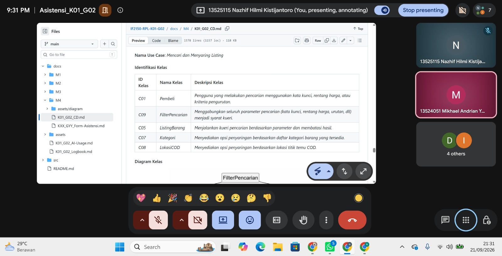

# Form Asistensi

## Tugas Besar IF2150 - Rekayasa Perangkat Lunak

| Informasi | Keterangan |
| --- | --- |
| **Hari** | Senin |
| **Tanggal** | 21/09/2026 |
| **Kelas** | K01 |
| **Nomor Kelompok** | G02  |
| **Nama Kelompok** | Indeks A  |
| **Nama Perangkat Lunak** | ITBELI  |
| **Dokumen** | K01_G02_CD  |

### Anggota Kelompok

| NIM | Nama |
| --- | --- |
| *13525124* | *Sulthan Dhiyazka Suwandi* |
| *13525034* | *Dhanesworo Muhammad Datiputro* |
| *13525115* | *Nazhif Hilmi Kistijantoro* |
| *13525121* | *I Made Adi Kusuma Ardana* |
| *13525106* | *Ghaniyul Amri Caulava* |

### Catatan

| Catatan |
| --- |
| 1. Kelas yang berhubungan dengan database dan udh cocok, tapi baru tentang database nya. tp blm bahas ttg frontend, client side, api, dll.  |
| 2. sesiOtentikasi gaperlu ada di database. |
| 3. menghindari god class.|
| 4. atribut : data yg disimpen, method : fungsi yang dimiliki. |

**Notes for this section:**  
*Catatan dapat dituliskan dalam bentuk paragraf atau poin-poin, disesuaikan saja.* 

## Dokumentasi

<!--  -->

  

  <i>Gambar 1. Dokumentasi kegiatan asistensi.</i>

