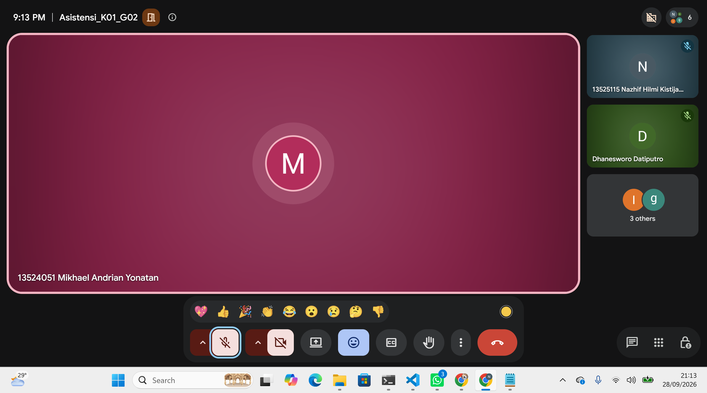

# Form Asistensi

## Tugas Besar IF2150 - Rekayasa Perangkat Lunak

| Informasi | Keterangan |
| --- | --- |
| **Hari** | *Senin* |
| **Tanggal** | *\[28/09/2026\]* |
| **Kelas** | *K1* |
| **Nomor Kelompok** | *G02*  |
| **Nama Kelompok** | *Indeks A*  |
| **Nama Perangkat Lunak** | *ITBELI*  |
| **Dokumen** | *K01_G02_SKPL*  |

### Anggota Kelompok

| NIM | Nama |
| --- | --- |
| *13525124* | *Sulthan Dhiyazka Suwandi* |
| *13525034* | *Dhanesworo Muhammad Datiputro* |
| *13525115* | *Nazhif Hilmi Kistijantoro* |
| *13525121* | *I Made Adi Kusuma Ardana* |
| *13525106* | *Ghaniyul Amri Caulava* |

### Catatan

| Catatan |
| --- |
| 1. Untuk bagian diagram kelasnya, dibikin konsisten antara per bagian dengan yang keseluruhan  |
| 2. Buat lingkungan operasi sistem, bagian client ditulis aja chromium based web browser.  |
| 3. Nanti pas implementasi, boleh local aja asalkan bisa diakses dengan device lain yang internetnya sama. Tapi untuk databasenya tidak boleh lokal karena harus konsisten. Sarannya pakai supabase. |
| 4. Referensi diambil yang dari sumber lain saja, bukan dari dokumen milestone sebelumnya. |
| 5. Traceability dibenerin lagi. |

**Notes for this section:**  
*Catatan dapat dituliskan dalam bentuk paragraf atau poin-poin, disesuaikan saja.* 

## Dokumentasi

<!--  -->

  

  <i>Gambar 1. Dokumentasi kegiatan asistensi.</i>

