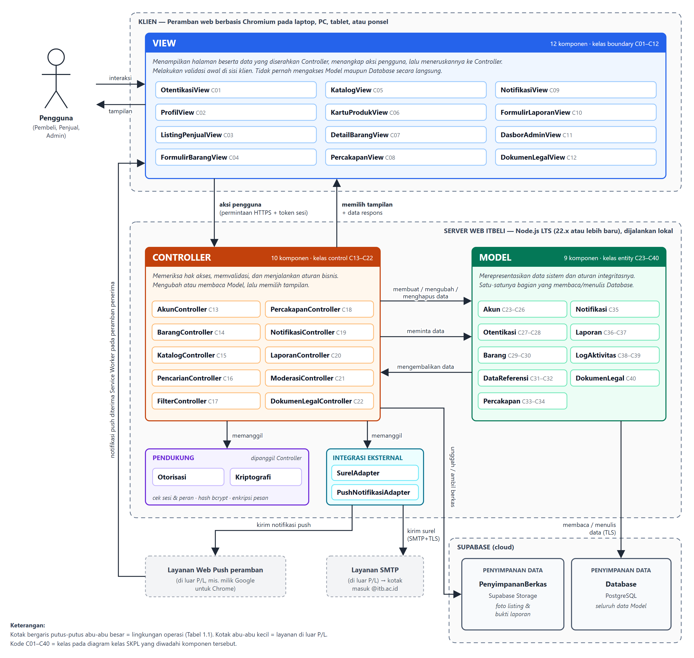
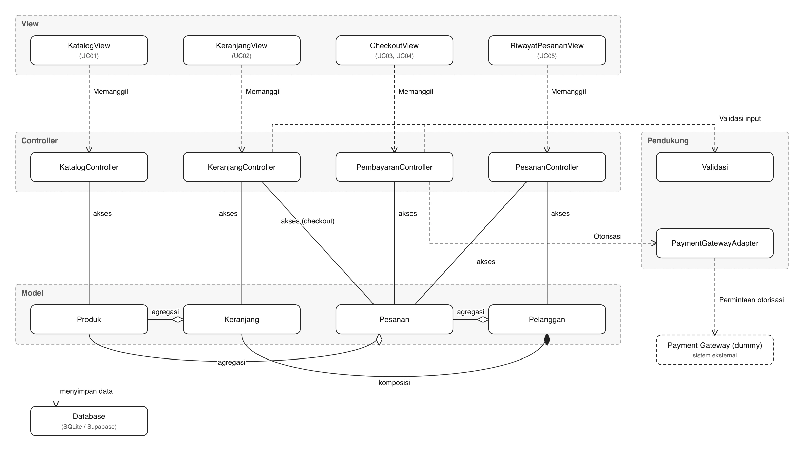

<h1>
IF2150 REKAYASA PERANGKAT LUNAK
 
TUGAS 6
 
ARSITEKTUR PERANGKAT LUNAK (APL)
</h1>
 

## *ITBELI*

### Untuk:  *Mikhael Andrian Yonatan*

Dipersiapkan oleh:

| Informasi | Keterangan |
| --- | --- |
| Kelas | *K01* |
| Kelompok | *G02*  |
| Nama Kelompok | *Indeks A*  |

| NIM | Nama |
|---|---|
| *13525124* | *Sulthan Dhiyazka Suwandi* |
| *13525034* | *Dhanesworo Muhammad Datiputro* |
| *13525115* | *Nazhif Hilmi Kistijantoro* |
| *13525121* | *I Made Adi Kusuma Ardana* |
| *13525106* | *Ghaniyul Amri Caulava* |

---

 
 

# BAB 1: Style/Pattern Arsitektur Acuan

ITBELI memakai pola **MVC (*Model-View-Controller*)** sebagai acuan arsitektur. Pola ini diterapkan di atas gaya **klien-server** yang telah ditetapkan pada subbab 2.5 dokumen SKPL. Gaya klien-server menentukan tempat setiap bagian sistem dijalankan, yaitu peramban milik pengguna sebagai klien dan server web ITBELI sebagai server. Adapun pola MVC menentukan pembagian tugas antarkomponen serta komponen mana yang boleh berhubungan dengan komponen lain. Pola MVC inilah yang menjadi dasar pengelompokan komponen pada BAB 2 dan model arsitektur pada BAB 3.

## 1.1 Pola MVC dan Peran Setiap Bagian

MVC memisahkan penyajian dan interaksi pengguna dari data sistem ke dalam tiga bagian yang saling terhubung (Sommerville, 2016). Pada aplikasi web, permintaan dari peramban diterima oleh *Controller*, yang kemudian memakai *Model* dan memilih *View* untuk menyusun tanggapan (Fowler, 2002). Peran setiap bagian pada ITBELI adalah sebagai berikut.

1. ***Model*** merepresentasikan data ITBELI, seperti akun, listing, percakapan, laporan, dan *log*, beserta aturan integritasnya. Contoh aturan integritas tersebut adalah status listing yang hanya boleh bernilai "Tersedia" atau "Terjual", jumlah foto maksimum 5 per listing, dan *log* audit yang hanya dapat ditambah. *Model* adalah satu-satunya bagian yang membaca dan menulis Database, dan *Model* tidak mengetahui keberadaan *View* maupun *Controller*. ITBELI memiliki 9 komponen *Model* yang mewadahi kelas *entity* C23–C40.
2. ***View*** menyajikan halaman kepada pengguna, menangkap aksi pengguna (klik, isian formulir, dan unggahan foto), lalu meneruskannya ke *Controller* sebagai permintaan. *View* hanya menampilkan data yang diserahkan oleh *Controller*. *View* boleh melakukan validasi awal di sisi klien, misalnya menandai isian yang belum lengkap (KF18), tetapi validasi ini hanya untuk kenyamanan pengguna. Berkas *View* disajikan oleh server web ITBELI lalu dijalankan pada peramban. ITBELI memiliki 12 komponen *View* yang mewadahi kelas *boundary* C01–C12.
3. ***Controller*** menerima permintaan dari *View*, memeriksa sesi dan hak akses melalui komponen Otorisasi, memvalidasi masukan, dan menjalankan aturan bisnis. Setelah itu, *Controller* meminta *Model* membaca atau mengubah data, lalu memilih tampilan berikutnya beserta data yang akan ditampilkan. ITBELI memiliki 10 komponen *Controller* yang mewadahi kelas *control* C13–C22.

Selain ketiga bagian tersebut, BAB 2 memuat komponen *Pendukung* (Otorisasi dan Kriptografi), *Integrasi Eksternal* (SurelAdapter dan PushNotifikasiAdapter), serta *Penyimpanan Data* (Database dan PenyimpananBerkas). Komponen-komponen ini tidak membentuk bagian keempat, melainkan alat bantu yang hanya dipanggil oleh *Controller*, kecuali Database yang hanya diakses oleh *Model*.

Agar pemisahan tersebut benar-benar terjaga saat implementasi, ITBELI menetapkan aturan ketergantungan berikut. Aturan ini juga menjadi pegangan saat menggambar *view* arsitektur pada BAB 3.

1. *View* tidak pernah mengakses *Model*, Database, maupun PenyimpananBerkas secara langsung. Seluruh permintaan data dari *View* melewati *Controller*.
2. *Controller* tidak menyusun tampilan. *Controller* hanya memilih *View* yang ditampilkan dan menyerahkan data yang dibutuhkannya.
3. *Model* tidak bergantung pada *View* maupun *Controller*, sehingga *Model* dapat diuji dan dipakai ulang tanpa antarmuka.
4. Aturan bisnis dan hak akses ditegakkan di *Controller*. Validasi yang dilakukan di *View* selalu diulang di *Controller*.
5. Komponen *Pendukung*, *Integrasi Eksternal*, dan PenyimpananBerkas hanya dipanggil oleh *Controller*, sedangkan Database hanya diakses oleh *Model*.

## 1.2 Alasan Pemilihan

Pemilihan MVC didasarkan pada karakteristik ITBELI yang telah dituangkan dalam dokumen SKPL, dengan rincian sebagai berikut.

1. **Meneruskan struktur *boundary–control–entity* pada SKPL.** Diagram kelas keseluruhan pada subbab 5.3 dokumen SKPL tersusun atas kelas *boundary* (C01–C12), *control* (C13–C22), dan *entity* (C23–C40). Hubungan antarkelasnya terdiri atas 15 asosiasi *boundary–control* dan 33 dependensi *control–entity/control*, tanpa satu pun relasi langsung antara kelas *boundary* dan kelas *entity*. Pola *boundary–control–entity* (Jacobson dkk., 1992) memiliki aturan hubungan yang sama dengan MVC, sehingga setiap kelas dapat dipetakan langsung ke *View*, *Controller*, atau *Model* tanpa mengubah rancangan yang sudah final. Dengan demikian, keterlacakan dari KF ke use case, kelas, komponen, hingga kode program tetap terjaga.

2. **Satu data ditampilkan dengan banyak cara kepada tiga jenis pengguna.** Subbab 2.2 dokumen SKPL menyatakan bahwa satu akun dapat berperan sebagai pembeli dan penjual secara bergantian, sedangkan admin melihat data yang sama dari sudut pandang moderasi. Data listing pada *Model* Barang, misalnya, ditampilkan pada KatalogView dan DetailBarangView bagi pembeli, pada ProfilView dan ListingPenjualView bagi penjual, serta menjadi objek laporan pada DasborAdminView bagi admin. Ringkasan listing bahkan ditampilkan oleh satu komponen yang sama, yaitu KartuProdukView, pada tiga halaman berbeda. Sommerville (2016) menyebut kondisi ketika data yang sama dapat dilihat dan diolah dengan banyak cara sebagai situasi utama penggunaan MVC. Dengan memisahkan *Model* dari *View*, data cukup didefinisikan satu kali dan setiap tampilan memakai sumber yang sama.

3. **Aturan bisnis dan hak akses harus ditegakkan di satu tempat yang tidak dapat dilewati pengguna.** Banyak KF ITBELI berbentuk penolakan, yaitu penolakan surel di luar domain @itb.ac.id (KF05), pendaftaran tanpa persetujuan kebijakan (KF14), *login* akun yang belum terverifikasi atau diblokir (KF08, KF53), perubahan listing oleh bukan pemilik (KF22), berkas foto yang melanggar ketentuan (KF24), akses percakapan oleh pihak luar (KF35), serta akses fungsi moderasi oleh bukan admin (KF56). Kode yang berjalan di peramban dapat diubah oleh penggunanya, sehingga aturan tersebut tidak boleh hanya berada di *View*. MVC menempatkan aturan tersebut di *Controller* yang berjalan di server. Hal ini sejalan dengan subbab 2.5 dokumen SKPL yang menetapkan bahwa kunci akses Supabase yang berhak penuh (*service role key*) hanya disimpan di sisi server. Karena *View* memang tidak memegang kunci tersebut, setiap akses data wajib melewati *Controller*.

4. **Privasi percakapan dan keamanan data dijamin oleh struktur, bukan hanya oleh kebijakan.** KNF03 dan batasan pada subbab 2.4 butir 4 dokumen SKPL mensyaratkan kata sandi dan isi percakapan tersimpan dalam bentuk terenkripsi, serta isi percakapan tidak dapat diakses oleh admin (KF35, KF38). Pada MVC, *Controller* melakukan *hash* kata sandi dan enkripsi pesan melalui Kriptografi sebelum data diserahkan ke *Model* (KF09, KF36), sehingga *Model* dan Database hanya pernah menyimpan nilai *hash* dan teks terenkripsi. Selain itu, ModerasiController sebagai satu-satunya *Controller* yang melayani DasborAdminView tidak bergantung pada *Model* Percakapan yang menyimpan isi pesan. Pada subbab 5.3 dokumen SKPL, dependensi C21 ModerasiController hanya mengarah ke C23 Akun, C26 Admin, C29 Barang, C36 Laporan, C38 LogAudit, C39 LogAdmin, dan C19 NotifikasiController. Akibatnya, tidak ada jalur dari tampilan admin menuju isi pesan. Laporan atas sebuah percakapan pun disusun oleh LaporanController hanya dari metadata percakapan tanpa isi pesan (KF37).

5. **Alur proses bisnis berbentuk permintaan dan tanggapan.** Seluruh skenario use case pada subbab 4.4 dokumen SKPL mengikuti pola yang sama, yaitu aktor melakukan aksi, lalu sistem memvalidasi, menyimpan atau mengambil data, dan menampilkan hasilnya. Pola ini sama dengan siklus *View* → *Controller* → *Model* → *Controller* → *View*. Efek samping pada alur bisnis, seperti pengiriman kode verifikasi (KF06), notifikasi pesan baru (KF34), pemberitahuan tindakan moderasi (KF52), serta pencatatan *log* audit dan *log* admin (KF48, KF55), cukup dipicu oleh *Controller* yang menangani aksi tersebut tanpa mengubah *View*.

6. **Mendukung kebutuhan non-fungsional.**
   - *Usability* (KNF01): tampilan dapat diperbaiki berulang kali berdasarkan hasil uji coba pengguna agar dapat dipahami dalam waktu kurang dari 10 menit, tanpa menyentuh logika bisnis maupun data.
   - *Maintainability* (KNF02): pencatatan aktivitas dilakukan oleh LaporanController dan ModerasiController ke *Model* LogAktivitas, sehingga penelusuran masalah oleh admin dan pengembang berpusat pada satu tempat. Pemisahan tanggung jawab juga membuat perbaikan pada satu bagian tidak merambat ke bagian lain.
   - *Security* (KNF03): dijelaskan pada butir 3 dan 4.
   - *Scalability* (KNF04): data disimpan terpusat pada Database, dan sesi *login* disimpan sebagai data pada *Model* Otentikasi, bukan di memori server. Dengan demikian, *Controller* tidak menyimpan keadaan antarpermintaan, sehingga rancangan ini tidak menghambat penambahan kapasitas server ketika jumlah pengguna bertambah.

7. **Sesuai dengan keterbatasan tim dan rencana pengembangan lanjutan.** Dokumen Tugas 1 (subbab 2.2.3) mencatat durasi pengembangan yang singkat dan jumlah anggota yang terbatas. MVC memungkinkan pembagian kerja secara paralel, karena anggota dapat mengerjakan *View* dan *Controller*/*Model* suatu fitur secara terpisah selama format data yang dipertukarkan sudah disepakati. Selain itu, *roadmap* pada subbab 2.1.2 dokumen Tugas 1 merencanakan pengembangan menjadi *Progressive Web App* lalu aplikasi *mobile native* yang "dibangun di atas layanan backend serta basis data yang sama dengan versi web". Pada MVC, aplikasi *mobile* cukup ditambahkan sebagai *View* baru yang memanggil *Controller* yang sama tanpa menduplikasi logika bisnis maupun data. Tahap *Progressive Web App* juga dapat memanfaatkan *Service Worker* yang sudah dipakai *View* untuk menerima notifikasi *push*.

**Kelemahan MVC dan penanganannya.** Sommerville (2016) mencatat bahwa MVC dapat menambah jumlah kode dan kompleksitas ketika model data dan interaksinya sederhana. Sebagian alur ITBELI memang sederhana, misalnya menampilkan dokumen legal (UC06) yang hanya melibatkan DokumenLegalView, DokumenLegalController, dan *Model* DokumenLegal. Tambahan kode ini diterima demi keseragaman, karena alur yang mengikuti pola yang sama lebih mudah ditelusuri dan diuji. Untuk mencegah *Controller* membengkak, fungsi yang dipakai berulang oleh beberapa *Controller* dipisahkan ke komponen *Pendukung* (Otorisasi dan Kriptografi) dan *Integrasi Eksternal* (SurelAdapter dan PushNotifikasiAdapter).

**Pola lain yang dipertimbangkan.**
- ***Client-server*** sudah dipakai sebagai gaya penempatan sistem sesuai subbab 2.5 dokumen SKPL. Namun, gaya ini hanya membagi sistem menjadi klien dan server tanpa mengatur susunan komponen di dalam server, sehingga tidak cukup untuk mengelompokkan 40 kelas pada diagram kelas SKPL. Karena itu, MVC dipakai sebagai acuan di atasnya.
- ***Layered architecture*** membagi sistem menjadi lapisan presentasi, logika bisnis, dan data, sehingga cukup mirip dengan MVC. Akan tetapi, setiap lapisan hanya melayani lapisan tepat di atasnya. Pada ITBELI, *Controller* juga menentukan tampilan berikutnya, dan satu *Model* ditampilkan oleh banyak *View*. Hubungan seperti ini dimodelkan langsung oleh MVC dan sudah tergambar pada pola *boundary–control–entity* di SKPL.
- ***Repository*** cocok bagi sistem yang beberapa subsistemnya bekerja secara mandiri di atas satu tempat penyimpanan data bersama, seperti IDE (Sommerville, 2016). ITBELI memang memakai basis data terpusat, tetapi peran tersebut sudah diwadahi oleh *Model* dan Database. Pola *repository* tidak menjelaskan alur interaksi pengguna yang menjadi inti ITBELI.
- ***Pipe and filter*** cocok untuk pemrosesan data bertahap, seperti pemrosesan *batch*, dan menurut Sommerville (2016) kurang sesuai untuk sistem interaktif. Hampir seluruh fungsi ITBELI bersifat interaktif.

## 1.3 Penerapan MVC pada ITBELI

<i>Gambar 1. Penerapan Pola MVC pada ITBELI</i>

Gambar 1 menempatkan seluruh komponen pada Tabel 2.1 ke dalam bagian MVC dengan nama yang sama, sekaligus menunjukkan lingkungan operasi tempat setiap bagian dijalankan. Kotak *View* berisi 12 komponen yang berjalan pada peramban (zona Klien). Kotak *Controller* dan *Model* berada pada zona Server Web ITBELI bersama komponen *Pendukung* dan *Integrasi Eksternal*. Komponen *Penyimpanan Data* berada pada Supabase. Layanan Web Push peramban dan layanan SMTP digambarkan dengan kotak abu-abu karena keduanya berada di luar P/L ITBELI dan tidak termasuk komponen pada Tabel 2.1. Kode kelas di samping nama komponen (misalnya C01) menunjukkan kelas pada diagram kelas SKPL yang diwadahi komponen tersebut.

Arti setiap panah pada Gambar 1 adalah sebagai berikut.
- **interaksi** dan **tampilan**: pengguna hanya berinteraksi dengan *View*.
- **aksi pengguna (permintaan HTTPS + token sesi)**: *View* meneruskan aksi pengguna ke *Controller* beserta token sesi untuk diperiksa oleh Otorisasi.
- **memilih tampilan + data respons**: *Controller* menentukan tampilan berikutnya dan menyerahkan data yang dibutuhkan *View*.
- **membuat/mengubah/menghapus data**, **meminta data**, dan **mengembalikan data**: *Controller* mengubah atau membaca keadaan sistem melalui *Model*, lalu *Model* mengembalikan hasilnya.
- **memanggil**: *Controller* memakai komponen *Pendukung* dan *Integrasi Eksternal*.
- **unggah/ambil berkas**: BarangController dan LaporanController menyimpan atau mengambil berkas foto dan bukti pada PenyimpananBerkas, sedangkan *Model* Barang dan Laporan hanya mencatat lokasi berkasnya.
- **membaca/menulis data (TLS)**: *Model* menyimpan dan mengambil data dari Database melalui koneksi terenkripsi.
- **kirim surel (SMTP+TLS)**, **kirim notifikasi push**, dan **notifikasi push diterima Service Worker pada peramban penerima**: jalur pemberitahuan dari NotifikasiController kepada pengguna melalui SurelAdapter dan PushNotifikasiAdapter.

**Perbedaan dengan MVC klasik.** Pada MVC klasik (Krasner & Pope, 1988), *Model* memberi tahu *View* secara langsung setiap kali datanya berubah, dan *View* dapat membaca *Model* sendiri. Pada ITBELI hal ini tidak diterapkan, karena *View* berjalan pada peramban yang terpisah dari server dan tidak memegang kunci akses basis data. Oleh karena itu, ITBELI memakai varian MVC untuk aplikasi web, yaitu *View* hanya diperbarui sebagai tanggapan atas permintaan ke *Controller*. Pemberitahuan yang harus sampai kepada pengguna walaupun aplikasi sedang tidak dibuka (KF34) dikirim oleh *Controller* melalui NotifikasiController, PushNotifikasiAdapter, dan layanan Web Push, lalu ditampilkan oleh *Service Worker* pada peramban penerima.

**Contoh alur: mengirim pesan dalam percakapan (UC17).** Alur berikut menunjukkan bagaimana seluruh bagian pada Gambar 1 bekerja sama.
1. Pengguna menulis pesan pada PercakapanView lalu menekan tombol kirim. PercakapanView mengirim permintaan HTTPS beserta token sesi ke PercakapanController.
2. Otorisasi memeriksa token sesi dan mengidentifikasi akun pengirim. Berdasarkan identitas tersebut, PercakapanController memastikan bahwa pengirim merupakan salah satu dari dua peserta percakapan (KF35).
3. PercakapanController meminta Kriptografi mengenkripsi isi pesan, lalu meminta *Model* Percakapan menyimpan pesan terenkripsi tersebut (KF36). *Model* Percakapan menuliskannya ke Database.
4. PercakapanController meminta NotifikasiController membuat notifikasi pesan baru. NotifikasiController menyimpan notifikasi melalui *Model* Notifikasi dan mengirim notifikasi *push* melalui PushNotifikasiAdapter ke peramban penerima (KF34).
5. PercakapanController memilih tampilan ruang percakapan dan menyerahkan daftar pesan yang sudah didekripsi kepada PercakapanView untuk ditampilkan secara berurutan beserta waktu pengirimannya (KF32).

## 1.4 Lingkungan Operasi Perangkat Lunak

Tabel 1.1 disalin tanpa perubahan dari subbab 2.5 *Lingkungan Operasi Perangkat Lunak* pada dokumen SKPL.

Tabel 1.1. Lingkungan Operasi Perangkat Lunak

| Komponen | Spesifikasi |
| :--- | :--- |
| Server | Satu komputer atau laptop milik tim pengembang yang menjalankan server web ITBELI (penyaji halaman antarmuka dan logika bisnis) menggunakan Node.js versi LTS (22.x atau lebih baru). Server dijalankan secara lokal, bukan pada layanan *hosting cloud*, dan harus tetap menyala selama sistem digunakan. |
| OS Server | Windows 10/11, macOS, atau distribusi Linux 64-bit (misalnya Ubuntu 22.04 LTS atau lebih baru). |
| DBMS | PostgreSQL terkelola pada layanan *cloud* Supabase. Basis data tidak dijalankan secara lokal agar data tetap konsisten bagi seluruh perangkat dan anggota tim. Server terhubung ke Supabase melalui koneksi terenkripsi (TLS), dan kunci akses Supabase yang berhak penuh (*service role key*) hanya disimpan di sisi server. |
| Penyimpanan Berkas | Supabase Storage untuk menyimpan foto listing (JPG/PNG, maksimum 5 MB per berkas dan 5 foto per listing) serta berkas bukti tangkapan layar pada laporan. |
| Layanan Surel | Layanan pengiriman surel berbasis SMTP dengan TLS untuk mengirim kode verifikasi berbatas waktu 15 menit ke alamat surel @itb.ac.id pendaftar serta pemberitahuan tindakan moderasi kepada pengguna. |
| Jaringan | Server dan perangkat klien terhubung ke jaringan lokal yang sama (Wi-Fi, LAN, atau *hotspot*). Klien mengakses ITBELI melalui alamat IP lokal server beserta port aplikasi (contoh: `https://192.168.1.10:3000`), sehingga *firewall* pada server harus mengizinkan koneksi masuk ke port tersebut. Server dan klien juga memerlukan koneksi internet untuk mengakses layanan Supabase dan layanan surel. |
| Protokol | HTTPS dengan sertifikat TLS yang dipercaya oleh perangkat klien (misalnya sertifikat lokal yang dibuat menggunakan mkcert lalu dipasang pada perangkat klien). Koneksi aman ini diperlukan karena peramban hanya mengaktifkan *Service Worker* dan notifikasi *push* pada *secure context*, sedangkan kedua fitur tersebut dibutuhkan untuk mengirim notifikasi pesan baru ketika aplikasi sedang tidak dibuka (KF34). HTTPS juga melindungi kata sandi dan token sesi selama pengiriman data. |
| Client | Peramban web berbasis Chromium (*Chromium-based web browser*) versi stabil terbaru, seperti Google Chrome, Microsoft Edge, Brave, atau Opera, dengan JavaScript, *cookie* dan penyimpanan lokal, serta izin notifikasi dalam keadaan aktif. |
| Perangkat Klien | Laptop, PC, tablet, atau ponsel pintar yang mampu menjalankan versi stabil terbaru peramban berbasis Chromium. |
| OS Klien | Windows 10/11, macOS, Linux, ChromeOS, dan Android 10 atau lebih baru. Perangkat iOS dan iPadOS tidak termasuk lingkungan yang didukung karena seluruh peramban pada sistem operasi tersebut menggunakan mesin WebKit, bukan Chromium. |

Kaitan teknologi pada Tabel 1.1 dengan pola MVC adalah sebagai berikut.

1. **Server (Node.js).** Berbeda dengan Django yang secara bawaan mengikuti pola MVT, Node.js tidak membawa pola arsitektur bawaan. Akibatnya, penerapan MVC menjadi tanggung jawab tim melalui pembagian modul dan aturan ketergantungan pada subbab 1.1. Setiap komponen pada Tabel 2.1 diwujudkan sebagai satu modul kode, dan modul-modul dikelompokkan ke dalam direktori sesuai jenisnya (*View*, *Controller*, *Model*, *Pendukung*, dan *Integrasi Eksternal*). Server Node.js menjalankan *Controller*, *Model*, *Pendukung*, dan *Integrasi Eksternal*, sekaligus menyajikan berkas *View* ke peramban, sesuai peran server pada Tabel 1.1 sebagai "penyaji halaman antarmuka dan logika bisnis".
2. **Client (peramban berbasis Chromium).** Peramban adalah tempat *View* dijalankan. JavaScript memungkinkan validasi awal di sisi klien. *Cookie* dan penyimpanan lokal menyimpan token sesi yang dilampirkan pada setiap permintaan ke *Controller*. Izin notifikasi memungkinkan *Service Worker* menerima notifikasi *push* dari PushNotifikasiAdapter.
3. **DBMS (PostgreSQL pada Supabase).** Database menyimpan data seluruh komponen *Model*. Basis data relasional sesuai dengan relasi antar-*entity* pada subbab 5.3 dokumen SKPL, karena asosiasi dan komposisi antarkelas dapat diwujudkan sebagai relasi antartabel. Ketentuan bahwa *service role key* hanya disimpan di sisi server memastikan hanya *Model* di server yang dapat mengakses Database, sesuai aturan ketergantungan butir 1 dan 5.
4. **Penyimpanan Berkas (Supabase Storage).** Penyimpanan berkas diwujudkan sebagai komponen PenyimpananBerkas. BarangController dan LaporanController memeriksa ketentuan berkas, seperti format JPG/PNG, ukuran maksimum 5 MB, dan maksimum 5 foto per listing, sebelum mengunggahnya. *Model* Barang dan Laporan hanya menyimpan lokasi berkas tersebut.
5. **Layanan Surel (SMTP dengan TLS).** Layanan surel hanya diakses melalui SurelAdapter yang dipanggil oleh NotifikasiController. Jika penyedia layanan surel berganti, perubahan cukup dilakukan pada SurelAdapter tanpa mengubah *Controller* lain.
6. **Jaringan dan Protokol (HTTPS).** Hubungan *View* ke *Controller* pada Gambar 1 berjalan melalui HTTPS pada jaringan lokal. HTTPS juga menyediakan *secure context* yang dibutuhkan peramban untuk mengaktifkan *Service Worker*, sehingga jalur notifikasi *push* pada Gambar 1 dapat berfungsi.
7. **Perangkat Klien, OS Server, dan OS Klien.** Ketiga komponen ini tidak memengaruhi pembagian MVC. Node.js dan peramban berbasis Chromium tersedia lintas platform, sehingga komponen yang sama dapat dijalankan pada seluruh sistem operasi dan perangkat yang tercantum pada Tabel 1.1.

---

# BAB 2: Identifikasi Komponen / Modul / Subsistem

Komponen ITBELI dikelompokkan mengikuti pola MVC (*Model-View-Controller*) yang ditetapkan pada BAB 1. Pengelompokan ini diturunkan dari diagram kelas keseluruhan pada subbab 5.3 dokumen SKPL yang sudah tersusun dalam tiga lapis *boundary–control–entity*. Kelas *boundary* (C01–C12) menjadi komponen *View*, kelas *control* (C13–C22) menjadi komponen *Controller*, dan kelas *entity* (C23–C40) dikelompokkan berdasarkan data yang dikelolanya menjadi komponen *Model*, sehingga satu komponen *Model* dapat mewadahi lebih dari satu kelas.

Selain ketiga jenis tersebut, terdapat tiga jenis komponen tambahan:
1. ***Pendukung***, yaitu komponen bantu yang dipakai bersama oleh beberapa *controller*, yaitu pemeriksaan sesi *login* dan fungsi kriptografi.
2. ***Integrasi Eksternal***, yaitu penghubung ke layanan di luar P/L yang tercantum pada subbab 2.5 dokumen SKPL, yaitu layanan surel SMTP dan layanan notifikasi *push* milik *web browser* (*Web Push*). 
3. ***Penyimpanan Data***, yaitu basis data PostgreSQL dan penyimpanan berkas pada Supabase.

Tabel 2.1. Identifikasi Komponen/Modul/Subsistem

| Nama Komponen/Modul/Subsistem | Jenis | Penjelasan |
| :--- | :--- | :--- |
| OtentikasiView | *View* | Menampilkan formulir pendaftaran beserta kebijakan privasi dan kendali persetujuannya, formulir kode verifikasi beserta hitung mundur dan tombol kirim ulang, formulir *login*, serta tombol keluar. Seluruh aksi diteruskan ke AkunController. Mewadahi kelas C01 HalamanOtentikasi. |
| ProfilView | *View* | Menampilkan nama, NIM, surel, dan daftar listing milik akun (melalui KartuProdukView), menu pengaturan akun, serta tautan Kebijakan Privasi. Mewadahi kelas C02 HalamanProfil. |
| ListingPenjualView | *View* | Menampilkan seluruh listing milik penjual yang dikelompokkan per status ("Tersedia" dan "Terjual") beserta tombol hapus, tandai terjual, dan batalkan penandaan terjual, lalu meneruskan aksi tersebut ke BarangController. Mewadahi kelas C03 HalamanListingPenjual. |
| FormulirBarangView | *View* | Menampilkan formulir pembuatan dan pengubahan listing (judul, harga, deskripsi kondisi, kategori, lokasi titik temu COD, dan foto), melakukan validasi awal di sisi klien, dan menandai isian yang belum lengkap sebelum diteruskan ke BarangController. Mewadahi kelas C04 FormulirBarang. |
| KatalogView | *View* | Menampilkan katalog listing berhalaman (maksimum 20 listing per halaman), kolom pencarian, pilihan filter dan pengurutan, serta pesan barang tidak ditemukan. Aksi diteruskan ke KatalogController, PencarianController, dan FilterController. Mewadahi kelas C05 HalamanKatalog. |
| KartuProdukView | *View* | Menampilkan ringkasan satu listing (foto utama, judul, harga, dan status). Dipakai bersama oleh KatalogView, ProfilView, dan ListingPenjualView. Mewadahi kelas C06 KartuProduk. |
| DetailBarangView | *View* | Menampilkan seluruh foto, judul, harga, deskripsi kondisi, kategori, lokasi titik temu COD, dan identitas penjual sebuah listing, beserta tombol "Hubungi Penjual" yang diteruskan ke PercakapanController dan aksi pelaporan yang diteruskan ke LaporanController. Mewadahi kelas C07 HalamanDetailBarang. |
| PercakapanView | *View* | Menampilkan daftar percakapan beserta cuplikan pesan terakhir dan penanda pesan belum dibaca, ruang percakapan berisi pesan yang berurutan beserta waktu pengiriman, kolom pengiriman pesan, serta tautan Kebijakan Privasi. Aksi diteruskan ke PercakapanController. Mewadahi kelas C08 HalamanPercakapan. |
| NotifikasiView | *View* | Menampilkan daftar pemberitahuan serta penanda jumlah pesan atau notifikasi yang belum dibaca, lalu meneruskan penandaan sudah dibaca ke NotifikasiController. Mewadahi kelas C09 PanelNotifikasi. |
| FormulirLaporanView | *View* | Menampilkan formulir pelaporan berisi pilihan kategori laporan (penipuan, konten tidak pantas, atau *bug*), isian alasan, dan unggahan bukti tangkapan layar, lalu meneruskannya ke LaporanController. Mewadahi kelas C10 FormulirLaporan. |
| DasborAdminView | *View* | Menampilkan daftar laporan beserta penyaring status, detail laporan, serta tombol ubah status, hapus listing, blokir akun, dan buka blokir akun lengkap dengan isian alasan dan konfirmasi. Aksi diteruskan ke ModerasiController. Mewadahi kelas C11 DasborAdmin. |
| DokumenLegalView | *View* | Menampilkan isi Kebijakan Privasi dan Ketentuan Penggunaan, termasuk menyoroti pernyataan bahwa isi percakapan pribadi tidak dapat diakses oleh admin maupun pengembang. Mewadahi kelas C12 HalamanDokumenLegal. |
| AkunController | *Controller* | Memproses pendaftaran akun (validasi domain @itb.ac.id, keunikan surel, dan persetujuan kebijakan), pembuatan, pengiriman ulang, dan pencocokan kode verifikasi, *login* (pencocokan kata sandi dan pemeriksaan status akun), *logout*, serta pengambilan data profil. Mewadahi kelas C13 AkunController. |
| BarangController | *Controller* | Memproses pembuatan, pengubahan, dan penghapusan listing, validasi isian dan foto, verifikasi kepemilikan listing, perubahan status "Tersedia"/"Terjual", pengambilan daftar listing milik penjual, serta pengambilan detail listing. Mewadahi kelas C14 BarangController. |
| KatalogController | *Controller* | Mengambil listing berstatus "Tersedia" milik akun yang tidak diblokir, membaginya menjadi halaman berisi maksimum 20 listing, dan mengurutkannya sesuai kriteria terbaru, harga terendah, atau harga tertinggi. Mewadahi kelas C15 KatalogController. |
| PencarianController | *Controller* | Menormalisasi kata kunci dan mencocokkannya dengan judul serta deskripsi listing yang tersedia. Mewadahi kelas C16 PencarianController. |
| FilterController | *Controller* | Memvalidasi parameter filter dan menyaring listing berdasarkan kategori, rentang harga minimum–maksimum, dan lokasi titik temu COD. Mewadahi kelas C17 FilterController. |
| PercakapanController | *Controller* | Membuka ruang percakapan antara pembeli dan penjual sebuah listing, memastikan hanya kedua peserta yang dapat mengaksesnya, mengenkripsi dan mendekripsi pesan melalui Kriptografi, menyimpan pesan, serta menyusun daftar percakapan beserta cuplikan pesan terakhir dan jumlah pesan belum dibaca. Meminta NotifikasiController mengirim notifikasi pesan baru. Mewadahi kelas C18 PercakapanController. |
| NotifikasiController | *Controller* | Membuat dan mengirim pemberitahuan kepada pengguna, yaitu kode verifikasi dan pemberitahuan tindakan moderasi melalui SurelAdapter, notifikasi pesan baru melalui PushNotifikasiAdapter, serta notifikasi di dalam aplikasi. Juga memperbarui status baca notifikasi. Mewadahi kelas C19 NotifikasiController. |
| LaporanController | *Controller* | Memproses pembuatan laporan, meliputi validasi data dan berkas bukti, penyusunan metadata percakapan tanpa isi pesan, penyimpanan laporan berstatus "Baru" beserta buktinya, serta pencatatan penerimaan laporan ke *log* audit. Mewadahi kelas C20 LaporanController. |
| ModerasiController | *Controller* | Memproses fungsi moderasi khusus admin, meliputi penampilan dan penyaringan laporan, perubahan status penanganan, penghapusan listing yang dilaporkan, pemblokiran dan pembukaan blokir akun (termasuk menonaktifkan dan memulihkan listing milik akun tersebut), serta pencatatan tindakan ke *log* admin dan *log* audit. Mewadahi kelas C21 ModerasiController. |
| DokumenLegalController | *Controller* | Mengambil versi terbaru dokumen Kebijakan Privasi dan Ketentuan Penggunaan beserta klausul privasi percakapan. Mewadahi kelas C22 DokumenLegalController. |
| Akun | *Model* | Merepresentasikan data akun pengguna (identitas, *hash* kata sandi, status verifikasi, status blokir, dan peran) beserta peran Pembeli, Penjual, dan Admin, serta metode untuk mengakses dan mengubahnya. Mewadahi kelas C23 Akun, C24 Pembeli, C25 Penjual, dan C26 Admin. |
| Otentikasi | *Model* | Merepresentasikan kode verifikasi surel yang berlaku 15 menit dan sesi *login* bertoken yang berlaku paling lama 24 jam, serta metode untuk membuat, mencocokkan, dan menonaktifkannya. Mewadahi kelas C27 TokenVerifikasi dan C28 SesiLogin. |
| Barang | *Model* | Merepresentasikan data listing (judul, harga, deskripsi kondisi, kategori, lokasi titik temu COD, status, dan pemilik) beserta metadata fotonya (maksimum 5 foto per listing), serta metode untuk mengakses dan mengubahnya. Mewadahi kelas C29 Barang dan C30 FotoBarang. |
| DataReferensi | *Model* | Merepresentasikan daftar kategori barang tetap dan daftar titik temu COD yang menjadi pilihan pada formulir listing dan filter katalog. Mewadahi kelas C31 Kategori dan C32 LokasiCOD. |
| Percakapan | *Model* | Merepresentasikan ruang percakapan antara pembeli dan penjual untuk satu listing beserta pesan terenkripsi di dalamnya dan status bacanya, serta metode untuk mengakses dan mengubahnya. Mewadahi kelas C33 Percakapan dan C34 Pesan. |
| Notifikasi | *Model* | Merepresentasikan pemberitahuan kepada pengguna beserta status sudah atau belum dibaca. Mewadahi kelas C35 Notifikasi. |
| Laporan | *Model* | Merepresentasikan laporan pengguna (pelapor, objek yang dilaporkan, kategori, alasan, dan status penanganan) beserta metadata berkas buktinya, serta metode untuk mengakses dan mengubahnya. Mewadahi kelas C36 Laporan dan C37 BuktiLaporan. |
| LogAktivitas | *Model* | Merepresentasikan *log* audit atas penerimaan dan tindak lanjut laporan yang hanya dapat ditambah, tidak dapat diubah maupun dihapus, serta *log* admin atas setiap tindakan moderasi beserta pelaku, objek, waktu, dan alasannya. Mewadahi kelas C38 LogAudit dan C39 LogAdmin. |
| DokumenLegal | *Model* | Merepresentasikan dokumen Kebijakan Privasi dan Ketentuan Penggunaan beserta versi, status publikasi, dan tautannya. Mewadahi kelas C40 DokumenLegal. |
| Otorisasi | *Pendukung* | Memeriksa token sesi pada setiap permintaan yang memerlukan *login*, mengidentifikasi akun yang sedang masuk sebagai dasar verifikasi kepemilikan dan keanggotaan percakapan, serta menolak akses ke fungsi moderasi oleh akun yang tidak berperan admin. Dipakai bersama oleh AkunController, BarangController, PercakapanController, LaporanController, dan ModerasiController. |
| Kriptografi | *Pendukung* | Menyediakan fungsi *hash* dan pencocokan kata sandi dengan bcrypt untuk AkunController, serta enkripsi dan dekripsi isi pesan untuk PercakapanController, sehingga kata sandi dan isi pesan tidak pernah tersimpan dalam bentuk teks biasa. |
| SurelAdapter | *Integrasi Eksternal* | Mengirim surel melalui layanan SMTP dengan TLS, yaitu kode verifikasi ke alamat surel @itb.ac.id pendaftar serta pemberitahuan tindakan moderasi beserta alasannya kepada pengguna yang bersangkutan. Dipanggil oleh NotifikasiController. |
| PushNotifikasiAdapter | *Integrasi Eksternal* | Mengirim notifikasi pesan baru melalui layanan *Web Push* milik *web browser* (misalnya layanan milik Google untuk Chrome) sehingga notifikasi muncul di perangkat penerima seperti notifikasi aplikasi pada umumnya, termasuk saat ITBELI sedang tidak dibuka. Notifikasi ditampilkan oleh *Service Worker* ITBELI yang terpasang pada *web browser* penerima. Dipanggil oleh NotifikasiController. |
| Database | *Penyimpanan Data* | Basis data PostgreSQL pada Supabase yang menyimpan seluruh data model secara persisten dan terpusat sehingga data konsisten bagi seluruh perangkat. |
| PenyimpananBerkas | *Penyimpanan Data* | Supabase Storage yang menyimpan berkas foto listing dan berkas bukti tangkapan layar laporan, sedangkan lokasi berkasnya dicatat pada model Barang dan Laporan. Diakses oleh BarangController dan LaporanController. |

Seluruh 40 kelas pada diagram kelas SKPL tercakup oleh 21 komponen *View*, *Controller*, dan *Model* di atas, sebagaimana dicantumkan pada kolom Penjelasan, sehingga seluruh use case pada dokumen SKPL dapat dijalankan oleh komponen-komponen tersebut.

---

# BAB 3: Model Arsitektur Perangkat Lunak

*Architectural View* adalah bagaimana cara kita melihat/mendeskripsikan arsitektur sebuah sistem dari sudut pandang tertentu. Dalam perancangan arsitektur aplikasi, dibutuhkan *Architectural View* yang dapat mempermudah pemahaman dari proses aplikasi yang akan dikembangkan. Tujuan dari *Architectural View* adalah menjadi bahan komunikasi, pemisahan masalah, mempermudah analisis, dan pemandu saat eksekusi pengembangan sistem tersebut.

Buatlah model arsitektur dari aplikasi yang akan dirancang dalam bentuk *view*. Model arsitektur ini berfungsi untuk memperlihatkan bagaimana setiap komponen, modul, dan subsistem saling berinteraksi serta berkolaborasi dalam menjalankan fungsi utama sistem secara keseluruhan. Anda dapat membuat satu atau lebih *view* tergantung kebutuhan dalam bentuk gambar. Pilihlah notasi yang sesuai. Contoh *view* yang dapat digunakan antara lain ***Logical View***, ***Process View***, ***Development View***, serta ***Physical View***.

Ketentuan pengisian BAB 3:
1. Setiap view menggambarkan **keseluruhan sistem**, bukan satu use case atau satu fitur saja.
2. Buat **minimal satu view**. Setiap view dituliskan dalam subbab tersendiri (3.1, 3.2, dan seterusnya). Tidak perlu membuat keempat view, pilih yang paling membantu menjelaskan P/L Anda, lalu jelaskan alasan pemilihannya.
3. Setiap view harus **konsisten dengan BAB 2**. Seluruh komponen pada Tabel 2.1 harus muncul dengan nama yang sama, dan tidak boleh ada komponen pada view yang tidak terdaftar di Tabel 2.1.
4. Setiap view harus **mencerminkan style/pattern pada BAB 1**. Misalnya, jika memilih MVC, pembagian *Model*, *View*, dan *Controller* harus terlihat jelas pada diagram.
5. Jika membuat lebih dari satu view, setiap view harus menggambarkan sistem yang sama dari sudut pandang berbeda. View tambahan melengkapi view pertama, bukan mengulanginya.
6. Beri label pada setiap garis atau panah yang menghubungkan komponen agar hubungan antarkomponen dapat dipahami tanpa penjelasan tambahan.
7. Jika membuat *Physical View*, gambarkan lingkungan operasi pada Tabel 1.1.

## 3.1 Logical View

<i>Gambar 2. Contoh Logical View pada P/L E-Commerce</i>

Gambar 2 menampilkan _logical view_ dalam bentuk _block diagram_ untuk pola arsitetur MVC (Model-View-Controller) pada program ITBELI. _Logical view_ digunakan untuk mendeskripsikan arsitektur karena batasan dan interaksi antarkomponen dapat tergambar dengan jelas, sehingga mempermudah saat proses implementasi. Selain itu, _block diagram_ dipilih karena mampu menyajikan interaksi komponen secara lebih menyeluruh dibandingkan class diagram, yang umumnya lebih berfokus pada hubungan antarkelas dalam konteks OOP (Object Oriented Programming). 

Pada diagram, relasi setiap komponen ditandai dengan garis yang menghubungkan antar komponen. Setiap garis dilabeli dengan keterangan singkat mengenai relasi tersebut, seperti "Memanggil"  atau "Agregasi". Komponen-komponen pendukung di luar dari Model, View, dan Controller berada diluar _swimlane_.                             

---

# Referensi

- Sommerville, I. (2016). *Software Engineering* (10th ed.). Pearson. Chapter 6: *Architectural Design*: [https://software-engineering-book.com/slides/](https://software-engineering-book.com/slides/)
- Fowler, M. (2002). *Patterns of Enterprise Application Architecture*. Addison-Wesley. Chapter 14: *Web Presentation Patterns*.
- Jacobson, I., Christerson, M., Jonsson, P., & Övergaard, G. (1992). *Object-Oriented Software Engineering: A Use Case Driven Approach*. Addison-Wesley.
- Krasner, G. E., & Pope, S. T. (1988). A cookbook for using the model-view-controller user interface paradigm in Smalltalk-80. *Journal of Object-Oriented Programming*, 1(3), 26–49.
- MDN Web Docs. *Service Worker API*: [https://developer.mozilla.org/en-US/docs/Web/API/Service_Worker_API](https://developer.mozilla.org/en-US/docs/Web/API/Service_Worker_API)
- MDN Web Docs. *Push API*: [https://developer.mozilla.org/en-US/docs/Web/API/Push_API](https://developer.mozilla.org/en-US/docs/Web/API/Push_API)
- Supabase. *Supabase Documentation*: [https://supabase.com/docs](https://supabase.com/docs)
- Diagram arsitektur: [https://www.drawio.com/](https://www.drawio.com/), [https://staruml.io/](https://staruml.io/)
