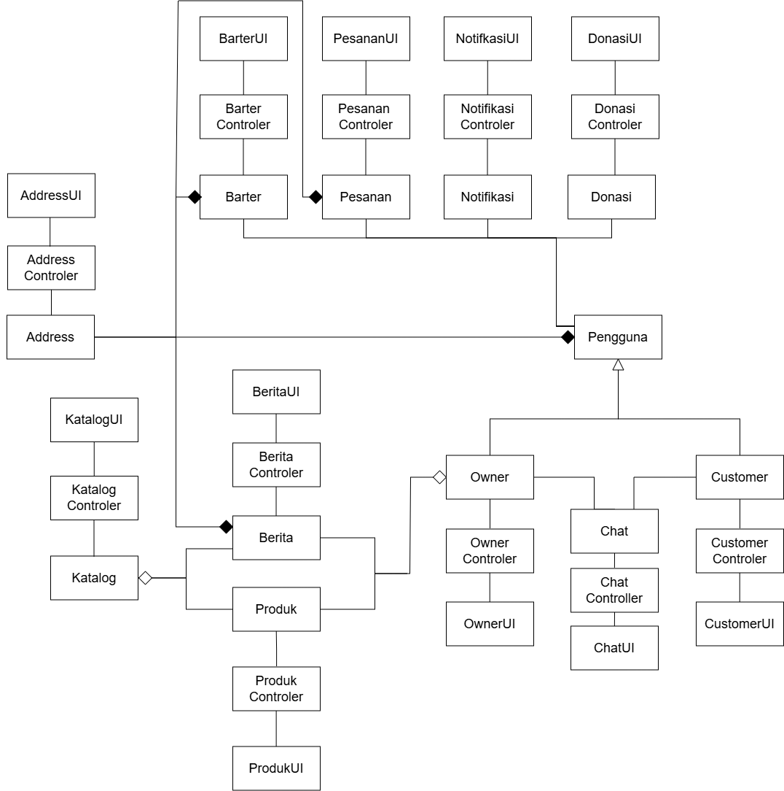

<h1>
IF2150 REKAYASA PERANGKAT LUNAK
 
TUGAS 5
 
DESKRIPSI PERANCANGAN PERANGKAT LUNAK (DPPL)
</h1>
 

## *ITBELI*
### *[Logo Perangkat Lunak]*

### Untuk:  *Mikhael Andrian Yonatan*

Dipersiapkan oleh:

| Informasi | Keterangan |
| --- | --- |
| Kelas | *K01* |
| Kelompok | *G02*  |
| Nama Kelompok | *Indeks A*  |

| NIM | Nama |
|---|---|
| *13525124* | *Sulthan Dhiyazka Suwandi* |
| *13525034* | *Dhanesworo Muhammad Datiputro* |
| *13525115* | *Nazhif Hilmi Kistijantoro* |
| *13525121* | *I Made Adi Kusuma Ardana* |
| *13525106* | *Ghaniyul Amri Caulava* |

---

## Daftar Perubahan

| Revisi | Deskripsi |
| :--- | :--- |
| *A* | *Deskripsikan perubahan yang dilakukan dari dokumen sebelumnya pada dokumen ini. Jika tidak terdapat perubahan, harap kosongkan tabel.* |
| *B* |  |
| *C* |  |
| ... |  |

---

 
>
>
 

---

# BAB 1: Pendahuluan

## 1.1 Tujuan Penulisan Dokumen
Dokumen Spesifikasi Kebutuhan Perangkat Lunak (SKPL) ini disusun dengan tujuan untuk mendefinisikan, mendokumentasikan, dan merinci seluruh batasan, spesifikasi, kebutuhan fungsional (KF), kebutuhan non-fungsional (KNF), serta arsitektur pemodelan sistem (Diagram Use Case dan Diagram Kelas) dari perangkat lunak ITBELI. Dokumen ini berfungsi sebagai landasan utama, panduan teknis yang mengikat, serta kontrak acuan dasar selama seluruh proses pengembangan perangkat lunak (SDLC).

### Pengguna utama dari dokumen ini meliputi:

#### 1. Pengembang Perangkat Lunak (Software Engineers/Developers): 
Sebagai acuan mutlak dalam menulis kode sumber (source code), membangun struktur basis data, dan mengimplementasikan logika bisnis sistem.

#### 2. Analis Sistem (System Analysts) & Desainer Antarmuka (UI/UX Designers): 
Sebagai pedoman terstruktur dalam merancang alur interaksi antarmuka (UI) dan pengalaman pengguna (UX).

#### 3. Tim Penguji (Quality Assurance/Testers): 
Sebagai standar rujukan pasti dalam menyusun matriks keterlacakan (traceability matrix), skenario pengujian (test case), dan validasi akhir sistem (UAT).

#### 4. Manajer Proyek (Project Managers) & Pemangku Kepentingan (Stakeholders): 
Sebagai tolak ukur evaluasi progres pengembangan, penyelesaian tenggat waktu, dan kelayakan rilis proyek perangkat lunak.

## 1.2 Lingkup Masalah
**ITBELI** adalah sebuah platform aplikasi marketplace barang preloved (bekas layak pakai) yang dirancang secara eksklusif untuk memfasilitasi transaksi jual-beli antar sivitas akademika Institut Teknologi Bandung (ITB). Sistem ini hadir sebagai solusi terpusat untuk mengatasi ketidakefisienan dan risiko penipuan pada transaksi jual-beli barang bekas mahasiswa yang selama ini tersebar tidak terstruktur di berbagai media sosial. Dengan mewajibkan verifikasi identitas menggunakan surel institusi (@itb.ac.id), perangkat lunak ini menyediakan ekosistem niaga yang aman dan tepercaya, dilengkapi dengan fitur manajemen katalog (listing), pencarian dan penyaringan barang spesifik kebutuhan kampus, ruang percakapan internal yang menjaga privasi negosiasi kesepakatan Cash on Delivery (COD), serta dasbor moderasi administratif untuk menindak tegas pelanggaran guna menjaga kenyamanan seluruh pengguna.

## 1.3 Definisi, Istilah, dan Singkatan
Semua definisi dan singkatan yang digunakan dalam dokumen ini beserta penjelasannya.

Tabel 1.3. Definisi Istilah dan Singkatan

| Singkatan, Akronim, atau Istilah | Penjelasan |
| :--- | :--- |
| *P/L* | *Singkatan dari Perangkat Lunak, yaitu aplikasi yang memberikan perintah kepada komputer untuk menjalankan tugas tertentu.* |
| *DPPL* | *Singkatan dari Spesifikasi Kebutuhan Perangkat Lunak, yaitu dokumen yang merangkum kriteria-kriteria yang diperlukan untuk membangun aplikasi menjalankan tugasnya.* |
| *KF* | *Singkatan dari Kebutuhan Fungsional, yaitu kapabilitas, perilaku, atau aksi spesifik yang harus mampu dilakukan oleh sistem (bagaimana sistem merespons input).* |
| *KNF* | *Singkatan dari Kebutuhan Non-Fungsional, yaitu batasan, kualitas, dan kriteria kinerja sistem (seperti keamanan, keandalan, dan waktu respons) dalam menjalankan fungsi-fungsinya.* |
| *UC* | *Singkatan dari Use Case, yaitu deskripsi interaksi atau skenario langkah demi langkah antara aktor (pengguna) dengan sistem untuk mencapai tujuan tertentu.* |
| *EARS* | *Singkatan dari Easy Approach to Requirements Syntax, yaitu standar pola penulisan spesifikasi kebutuhan bahasa alami agar konsisten, terstruktur, dan tidak ambigu.* |
| *ITBELI* | *Nama dari perangkat lunak (sistem) yang dibangun dan didokumentasikan di dalam dokumen SKPL ini.* |
| *Preloved* | *Istilah untuk barang bekas pakai milik pribadi yang kondisinya masih sangat layak fungsi untuk dijual dan digunakan kembali oleh orang lain.* |
| *Listing* | *Daftar barang dagangan yang dipublikasikan oleh penjual di dalam katalog sistem, mencakup sekumpulan data seperti foto, deskripsi, kondisi, dan harga barang.* |
| *COD* | *Singkatan dari Cash on Delivery, yaitu metode transaksi serah terima barang dan pembayaran secara langsung atau tatap muka di titik temu fisik wilayah kampus yang telah disepakati oleh pembeli dan penjual.* |
| *OTP* | *Singkatan dari One-Time Password, yaitu kode otentikasi berupa karakter numerik/alfanumerik unik yang di-generate oleh sistem dan hanya berlaku satu kali dalam batasan waktu tertentu (contoh: 15 menit) untuk memverifikasi surel pendaftar.* |
| *JWT* | *Singkatan dari JSON Web Token, yaitu standar terbuka untuk mengenkripsi dan membuat token sesi akses (bearer token) yang digunakan untuk memverifikasi hak akses otorisasi pengguna saat mereka masuk (login) ke dalam sistem.* |
| *Bcrypt / Hash* | *Fungsi algoritma kriptografi satu arah yang digunakan untuk mengacak dan menyamarkan kata sandi (password) pengguna sebelum disimpan di basis data, sehingga kerahasiaannya terjaga dan tidak dapat dibaca dalam bentuk teks murni (plain-text).* |
| *Log Audit* | *Catatan rekam jejak digital di dalam basis data sistem yang bersifat permanen, anti-ubah (immutable), dan kronologis untuk melacak kapan dan siapa admin yang melakukan tindakan moderasi tertentu.* |

## 1.4 Aturan Penomoran
Aturan penomoran (ID) pada dokumen ini mengikuti pola yang telah digunakan pada dokumen *Requirement Gathering* (Tugas 2), *Use Case & Scenario Use Case* (Tugas 3), dan *Class Diagram* (Tugas 4). Setiap ID terdiri atas awalan huruf yang menunjukkan jenis artefak dan diikuti dua digit angka urut yang dimulai dari 01 (XX = 01, 02, 03, dst.).

Tabel 1.4. Aturan Penomoran

| Hal/Bagian | Penomoran | Keterangan |
| :--- | :--- | :--- |
| *Kebutuhan (Pemetaan Kebutuhan)* | *RXX* | *R = Requirement. Menandai kebutuhan hasil pemetaan pada dokumen Requirement Gathering (R01–R27) dan dirujuk pada kolom "Kebutuhan" Tabel 3.1 serta kolom "ID Kebutuhan" Tabel 3.2.* |
| *Kebutuhan Fungsional* | *KFXX* | *KF = Kebutuhan Fungsional. Digunakan pada Tabel 3.1 (KF01–KF56).* |
| *Kebutuhan Non-Fungsional* | *KNFXX* | *KNF = Kebutuhan Non-Fungsional. Digunakan pada Tabel 3.2 (KNF01–KNF04).* |
| *Aktor* | *AXX* | *A = Aktor. Digunakan pada BAB 4.1 (A01–A03).* |
| *Use Case* | *UCXX* | *UC = Use Case. Digunakan pada BAB 4.2 hingga BAB 6 (UC01–UC24).* |
| *Kelas* | *CXX* | *C = Class. Digunakan pada BAB 5 dan BAB 6 (C01–C40), dengan pembagian C01–C12 untuk kelas boundary, C13–C22 untuk kelas control, dan C23–C40 untuk kelas entity.* |

## 1.5 Referensi
Berikut adalah referensi yang dirujuk dalam penyusunan dokumen ini.

1. Tim Pengajar IF2150, *Materi Perkuliahan (Slide) IF2150 Rekayasa Perangkat Lunak*, Sekolah Teknik Elektro dan Informatika, Institut Teknologi Bandung, Tahun Ajaran 2026/2027.
2. I. Sommerville, *Software Engineering*, 10th ed. Boston: Pearson, 2016.
3. A. Mavin, P. Wilkinson, A. Harwood, dan M. Novak, "Easy Approach to Requirements Syntax (EARS)," dalam *17th IEEE International Requirements Engineering Conference (RE'09)*, 2009, hlm. 317 – 322. https://ieeexplore.ieee.org/document/5328509/
4. M. Fowler, *UML Distilled: A Brief Guide to the Standard Object Modeling Language*, 3rd ed. Boston: Addison-Wesley, 2004.
5. Visual Paradigm, *Mastering UML: A Complete Guide to Use Case and Class Diagrams for Software Design*. https://www.visual-paradigm.com/guide/mastering-uml-a-complete-guide-to-use-case-and-class-diagrams-for-software-design/
6. PlantUML, *Activity Diagram - Syntax and Features*. https://plantuml.com/activity-diagram-beta
7. Undang-Undang Republik Indonesia Nomor 27 Tahun 2022 tentang Pelindungan Data Pribadi. https://peraturan.bpk.go.id/Details/229798/uu-no-27-tahun-2022
8. United Nations, *Sustainable Development Goals. Goal 12: Ensure sustainable consumption and production patterns*. https://sdgs.un.org/goals/goal12
9. Kementerian Lingkungan Hidup dan Kehutanan, *Sistem Informasi Pengelolaan Sampah Nasional (SIPSN). Data Timbulan Sampah*. https://sipsn.menlhk.go.id/sipsn/public/data/timbulan
10. Supabase, *Supabase Documentation*. https://supabase.com/docs
11. MDN Web Docs, *Secure Contexts*. https://developer.mozilla.org/en-US/docs/Web/Security/Secure_Contexts

## 1.6 Deskripsi Umum Dokumen (Ikhtisar)
Tuliskan sistematika pembahasan dokumen ini secara ringkas dan runut, dengan maksimal 1 paragraf.

 

---

# BAB 2: Perancangan Arsitektur

## 2.1 Rancangan Lingkungan Implementasi

Sebutkan *operating system*, DBMS, *development tools*, *filing system*, dan bahasa pemrograman yang digunakan.

## 2.2 Style/Pattern Arsitektur Acuan

Tentukan *architectural style* atau *pattern* yang menjadi acuan aplikasi, misalnya *layered architecture*, *client-server*, *repository*, *pipe and filter*, atau MVC (*Model-View-Controller*).

Gunakan hasil **BAB 1 Style/Pattern Arsitektur Acuan pada dokumen APL**, termasuk alasan pemilihan dan gambar penerapannya pada P/L kelompok. Gunakan komponen aplikasi sendiri pada gambar, bukan hanya contoh pola umum.

<i>Gambar 1. Contoh Arsitektur MVC</i>

## 2.3 Identifikasi Komponen / Modul / Subsistem

Identifikasi komponen, modul, atau subsistem penyusun aplikasi berdasarkan *pattern* yang telah ditetapkan. Jelaskan tanggung jawab masing-masing komponen. Pengelompokan dapat mengikuti lapisan arsitektur atau fungsi/peran komponen dalam sistem.

Ambil dari **Tabel 2.1 dokumen APL**, lalu kelompokkan berdasarkan lapisan (Model/View/Controller). Kolom **Jenis** diisi sesuai pattern, misalnya View, Controller, Model, Service, Repository. Satu komponen merepresentasikan saatu tanggung jawab utama yang jelas,

Tabel 2.3. Identifikasi Komponen/Modul/Subsistem

| Nama Komponen/Modul/Subsistem | Jenis | Penjelasan |
| :--- | :--- | :--- |
| *[Nama komponen/modul/subsistem]* | *[Jenis]* | *[Tanggung jawab komponen]* |
| *[Nama komponen/modul/subsistem]* | *[Jenis]* | *[Tanggung jawab komponen]* |
| *...* | *...* | *...* |

## 2.4 Model Arsitektur Perangkat Lunak

Buat model arsitektur dalam bentuk satu atau lebih *view* yang memperlihatkan interaksi dan kolaborasi komponen, modul, serta subsistem dalam menjalankan fungsi sistem. Pilih notasi yang sesuai. Contoh *view*: *Logical View*, *Process View*, *Development View*, dan *Physical View*.

Gunakan hasil **BAB 3 Model Arsitektur Perangkat Lunak pada dokumen APL**. 

### 2.4.1 View [Nama View]

Tuliskan secara singkat model arsitektur yang dipilih dan alasan model tersebut cocok untuk aplikasi.

<i>Gambar 2. Contoh Logical View pada P/L E-Commerce</i>

### 2.4.X View [Nama View]
*[Lakukan hal yang sama dengan bagian sebelumnya]*

 

---

# BAB 3: Realisasi Use Case

## 3.1 Use Case [Nama Use Case 1]

**ID Use Case:** *[UC01 sesuai SKPL]*  
**Nama Use Case:** *[Nama use case sesuai SKPL]*

### 3.1.1 Identifikasi Kelas

Identifikasi kelas yang terkait dengan use case tersebut. Kelas di tahap perancangan dapat berbeda dengan dengan kelas di tahap analisis. Dapat menggunakan tabel di bawah:

Tabel 3.1. Identifikasi Kelas Use Case [UC01]

| No | Nama Kelas Perancangan | Nama Kelas Analisis Terkait |
|:--- | :--- | :--- |
| 1 | *[Nama kelas perancangan]* | *[Nama kelas analisis pada SKPL]* |
| 2 | *[Nama kelas perancangan]* | *[Nama kelas analisis pada SKPL]* |
| ... | *...* | *...* |

### 3.1.2 Sequence Diagram

Buat *sequence diagram* untuk **setiap skenario use case**, mencakup skenario normal dan alternatif pada subbab 4.4 SKPL. Diagram melibatkan kelas-kelas yang telah diidentifikasi pada SKPL. 

- **Skenario Normal**

<i>Gambar X. Sequence Diagram [UC01]</i>

- **Skenario Alternatif [Nomor]: [Nama Skenario]**

<i>Gambar X. Sequence Diagram [UC01] - [Nama skenario alternatif]</i>

### 3.1.3 Diagram Kelas

Buatlah diagram kelas untuk use case ini yang terdiri atas kelas-kelas dari 3.1.1. **Setiap kelas pada diagram wajib menampilkan atribut dan metode/operasi langsung di dalam kotak kelasnya**, sehingga tidak perlu membuat tabel daftar atribut dan metode per kelas pada subbab ini. Daftar lengkap atribut dan metode seluruh kelas disajikan pada Tabel 4.1 (Bab 4).

<i>Gambar X. Diagram Kelas [Nama Uce Case]</i>

Pada diagram, pastikan:
- Atribut dituliskan beserta visibilitas dan tipe datanya, misalnya `- email: String`.
- Operasi dituliskan beserta visibilitas, parameter, dan tipe kembaliannya, misalnya `+ login(email: String, password: String): Boolean`.
- Relasi antarkelas (asosiasi, agregasi, komposisi, generalisasi, dan dependensi) digambarkan lengkap dengan multiplisitas.
- Semua operasi yang dipanggil pada sequence diagram 3.1.2 (skenario normal dan alternatif) ada pada kelas yang bersangkutan.
- Kelas yang sama dengan kelas di use case lain memakai nama, atribut, dan metode yang konsisten.

## 3.2 Use Case XX

Silahkan lanjutkan untuk  *use case* berikutnya dengan content yang sama dengan 3.1

 

---

# BAB 4: Diagram Kelas Keseluruhan

## 4.1 Diagram Kelas

**Bagian ini diisi dengan diagram kelas keseluruhan.**

<i>Gambar 4.1. Diagram Kelas Perancangan Keseluruhan [Nama P/L]</i>

Tabel 4.1. Daftar Kelas Perancangan Keseluruhan

| ID Kelas | Nama Kelas | Atribut | Metode/Operasi |
| :--- | :--- | :--- | :--- |
| *[C01]* | *[Nama kelas]* | *[Daftar atribut]* | *[Daftar metode/operasi]* |
| *[C02]* | *[Nama kelas]* | *[Daftar atribut]* | *[Daftar metode/operasi]* |
| *[C03]* | *[Nama kelas]* | *[Daftar atribut]* | *[Daftar metode/operasi]* |
| *...* | *...* | *...* | *...* |

 

---

# BAB 5: Matriks Kerunutan

Petakan kelas perancangan dengan use case yang terkait. Gunakan **BAB 6 Traceability pada dokumen SKPL** sebagai acuan keterkaitan kelas analisis dan use case, lalu sesuaikan dengan realisasi use case dan kelas perancangan pada BAB 3–BAB 5 DPPL.

Tabel 7.1. Matriks Kerunutan Kelas terhadap Use Case

| Kelas | Use Case Terkait |
| :--- | :--- |
| *[ID kelas - Nama kelas]* | *[ID UC - Nama use case]* |
| *[ID kelas - Nama kelas]* | *[ID UC - Nama use case]* |
| *...* | *...* |
